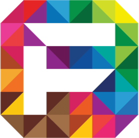

# Proyecto Feria Friki - Diseño UX / UI

## Desafío: Maquetación de sitio web con HTML, CSS y Bootstrap, basado en investigación de usuario y la marca Feria Friki.
## Build: https://ignaciovq27.github.io/feria-friki/
## Características:
### · Navbar con estructura de navegación simplificada, basada en los objetivos de reestructuración de la interacción de usuarios.
### · Carrusel principal con información de la marca y novedades de la web.
### · Sección destacada de próximos eventos y principales marcas de clientes de la web.
### · Galería de Tienda con los principales productos.
### · Sección de contacto y Footer de cierre con redes sociales de marca
